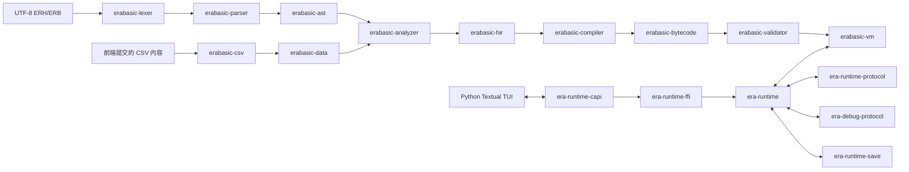

# RustyEra

RustyEra 是用 Rust 重新实现的 EraBasic 语言工具链与运行环境，兼容目标固定为
Emuera 参考实现提交 `26a35dc9334bb67590b96f7b8efbefbf199e391e`（Emuera 1.824
系列）。项目覆盖从 UTF-8 源码、静态数据、语义分析、字节码、虚拟机到可移植
runtime 协议和 C ABI 的完整链路。独立的 Python/Textual TUI 与 Vue/WebAssembly/Tauri
客户端通过公共边界集成 runtime。

项目仍处于开发阶段，尚未覆盖 Emuera 的全部指令、系统流程以及依赖
WinForms/GDI/CBG 的客户端能力。协议中存在类型或参考 CLI 能够执行某项操作，不代表
Rust 实现已经支持对应能力。

## 项目目标

发生目标冲突时，优先级依次为：

1. 跨客户端、跨平台支持；
2. 架构纯净；
3. 与固定 Emuera 参考实现严格保持行为一致。

这一顺序只用于解决冲突。只要不违背更高优先级，游戏规则、输入判定、状态变化以及
其他脚本可观察行为仍必须与参考实现一致。依赖具体窗口系统、字体、设备状态或像素
布局的行为，应提炼为 runtime 持有的可移植语义，再由不同前端投影。

RustyEra 只接受 UTF-8 源码和配置内容，不负责识别或转换 Shift-JIS、GBK 等传统编码。
详细原则见[设计原则](docs/design-principles.zh-CN.md)。

## 项目结构

### EraBasic 语言与执行链路

| 模块 | 职责 |
| --- | --- |
| `erabasic-ast` | 公共 AST、UTF-8 byte span 与稳定诊断结构。 |
| `erabasic-lexer` | 上下文相关词法分析、终止规则、宏与 FORM 字符串拆分。 |
| `erabasic-parser` | 表达式、逻辑行、ERH、ERB、预处理器与块结构解析。 |
| `era-config` | Era 配置项的可序列化模型与规范化处理。 |
| `erabasic-data` | 项目静态数据、初始化数据与存档加载契约。 |
| `erabasic-csv` | 只处理前端提交内容的内存 CSV 加载器，不执行文件 I/O。 |
| `erabasic-hir` | 稳定、可序列化的类型化高级中间表示。 |
| `erabasic-analyzer` | 项目级符号、类型、声明、指令参数与控制流分析。 |
| `erabasic-bytecode` | 版本化 VM 指令、Host ABI、自包含容器、源码映射与补丁。 |
| `erabasic-compiler` | 确定性、可并行且支持函数级缓存的 HIR 到字节码编译器。 |
| `erabasic-validator` | HIR 与不可信字节码的结构、类型、控制流和 ABI 验证。 |
| `erabasic-vm` | 确定性解释器、协作式多 fiber 调度、Host/Native 边界、快照与热替换。 |
| `erabasic-html` | EraBasic HTML 子集的规范化与安全文本处理。 |
| `erabasic-repl` | 用于人工检查 lexer、parser 和 analyzer 的开发工具。 |

### Runtime、协议与边界

| 模块 | 职责 |
| --- | --- |
| `era-protocol` | 确定性 CBOR 信封、版本协商、标识符、限制与诊断投影。 |
| `era-runtime-protocol` | 正常运行时的生命周期、项目、输入、展示、存储与服务消息。 |
| `era-debug-protocol` | 独立版本、按能力授权的调试协议。 |
| `era-runtime-save` | 不执行文件 I/O 的传统存档编解码、迁移与恢复。 |
| `era-runtime` | caller-pumped 权威 runtime，驱动 VM 并持有游戏、展示、交互和存档状态。 |
| `era-runtime-ffi` | 安全 Rust FFI 函数表与经过检查的结构声明。 |
| `era-runtime-capi` | C ABI 动态库实现；这是 workspace 中唯一包含原始指针 `unsafe` 边界的 crate。 |

### 外部前端、参考实现与工具

| 项目或路径 | 用途 |
| --- | --- |
| [rustyera-tui](https://github.com/PrunusSerrulata/rustyera-tui) | Python 3.12/Textual 前端，通过公共 C ABI 驱动 runtime。 |
| [rustyera-web](https://github.com/PrunusSerrulata/rustyera-web) | Vue、WebAssembly 和 Tauri 前端；包含 `era-web-bridge`。 |
| [emuera.em](https://github.com/PrunusSerrulata/emuera.em) | 固定版本的 C# 兼容性参考实现及 NDJSON oracle。 |
| `tools/project-extractor` | 项目解包器，从 `.reraproj` 中按原目录层级恢复 UTF-8 源码和二进制资产。 |
| `tools/snapshot-analyzer` | Runtime 快照分析器，校验完整快照并以文本或 JSON 展开其中的全部状态。 |
| `tools/runtime-tester` | runtime 与 C ABI 的人工/长流程测试工具。TUI 审计脚本位于 `rustyera-tui`。 |
| `tools/protocol-smoke.ps1`、`tools/test-macos-wine.sh` | Windows 与 macOS/Wine 参考 CLI 冒烟测试。 |

## 模块关系



应用前端负责文件扫描、UTF-8 解码、终端或 GUI 投影、平台输入与实际 I/O。runtime
只接收版本化消息和前端提交的数据，不直接访问文件系统、系统时钟或设备 API。

## 环境要求

- 当前稳定版 Rust 工具链，支持 workspace 使用的 Rust 2024 edition；
- 构建 TUI 时需要 Python 3.12 或更高版本及 `uv`；
- 运行 C# 参考 CLI 时需要 .NET 10 Windows Desktop 工具链；
- macOS 上运行参考 CLI 还需要 Wine、`jq` 和 Perl。

所有命令默认从仓库根目录执行。

## 编译

编译全部 Rust crate：

```sh
cargo build --workspace
```

编译 release C ABI 动态库：

```sh
cargo build --release -p era-runtime-capi
```

单独检出时动态库位于 `target/release/`；本文约定的四仓本地布局通过外层 Cargo 配置
统一写入 `../target/release/`。文件名分别为：

- macOS：`libera_runtime_capi.dylib`
- Linux：`libera_runtime_capi.so`
- Windows：`era_runtime_capi.dll`

## 使用方法

### EraBasic REPL

```sh
cargo run -p erabasic-repl
```

REPL 支持：

```text
:lex SOURCE
:expr SOURCE
:line SOURCE
:file PATH
:analyze PATH...
:help
:quit
```

`:file` 将 `.erh` 作为声明头处理，其他文件作为 ERB 处理。REPL 会保留同一个 parser
上下文，因此先加载的宏和声明会影响后续输入。它只是开发检查工具，不是游戏运行前端。

### 应用前端

TUI 和 Web 前端已拆分为独立仓库。TUI 使用发布的 C ABI 动态库；Web 仓库通过固定的
core Git revision 构建原生及 WebAssembly runtime。用法和发布说明分别见
[rustyera-tui](https://github.com/PrunusSerrulata/rustyera-tui) 与
[rustyera-web](https://github.com/PrunusSerrulata/rustyera-web)。

### 项目解包器

成功编译的 `.reraproj` v2 项目文件包含前端提交的完整项目内容。文件只保存一次源码与资源
payload；资源图、源码行索引和其他可由这些内容确定的数据会在加载时重建。`tools/project-extractor` 直接恢复
UTF-8 源码和图片等二进制资产，不会从字节码反推源码，因此不属于传统意义上的反编译器：

```sh
cargo run -p project-extractor -- \
  /path/to/project.reraproj [/path/to/output]
```

省略输出目录时写入当前工作目录。默认拒绝覆盖已有文件；显式传入 `--force` 才会覆盖
普通文件。工具恢复 CSV、ERH、ERB、配置、UTF-8 资源清单和缓存中嵌入的二进制资产，
全部保留原相对目录层级并校验内容哈希。v1 及更早项目文件会被明确拒绝：带源码的前端缓存
应重新编译，独立分发的旧文件需要由原版本导出内容后重新生成。工具也不支持通用 `.erbc`
字节码容器。

仓库维护者可构建解包器后，对 `reference/` 下发现的全部 Era 游戏执行编译缓存往返，
并逐字节比较源码和二进制资产：

```sh
cargo build -p project-extractor
cargo run --manifest-path tools/runtime-tester/Cargo.toml -- project-extractor-all
```

### Runtime 快照分析器

`tools/snapshot-analyzer` 读取 runtime 导出的完整快照，校验外层容器及其中嵌入的执行状态，
并输出快照内保存的项目身份、资源、展示、交互、控制器、存档、撤销、内存和 fiber 等状态：

```sh
cargo run -p snapshot-analyzer -- /path/to/runtime-snapshot.bin
cargo run -p snapshot-analyzer -- --json /path/to/runtime-snapshot.bin
```

默认输出按 section 和字段路径展开的文本，`--json` 输出带版本号的格式化 JSON；快照路径
是唯一位置参数，结果写入标准输出。图片、存档扩展、Host 重新绑定数据等不透明二进制内容
只输出字节长度和 BLAKE3 摘要。分析不需要项目目录，但也因此不能把 `SymbolKey` 还原成
源码名称，或执行依赖原字节码 artifact 的兼容性及最终恢复语义校验。工具只接受
`RERARTS` 完整 runtime 快照，不接受单独的 `RERAVMS` 内层容器。

### 作为 Rust 库使用

解析 ERH 与 ERB：

```rust
use erabasic_parser::{DefaultParserContext, parse_erb, parse_erh};

let mut context = DefaultParserContext::default();
let header = parse_erh("#DEFINE TEN 10\n", &mut context);
assert!(!header.has_errors());

let script = parse_erb("@TEST\nRESULT = TEN + 1\n", &mut context);
assert!(!script.has_errors());
```

加载前端已读取的 CSV：

```rust
use erabasic_csv::{CsvLoadOptions, FilePayload, FrontendFile, ProjectFiles, load_project};

let report = load_project(
    &ProjectFiles {
        csv: vec![FrontendFile {
            relative_path: "ABL.csv".into(),
            payload: FilePayload::Utf8("0,力量\n".into()),
        }],
        erb: vec![],
    },
    &CsvLoadOptions::default(),
);
assert!(report.data.is_some());
```

## 验证与测试

开发流程和测试职责以 [AGENTS.md](AGENTS.md) 为准。修改 Rust 实现时，先完成格式化，
处理全部编译器错误和 Clippy 警告，再执行全量测试：

```sh
cargo fmt --all
cargo check --workspace --all-targets
cargo clippy --workspace --all-targets -- -D warnings
cargo test --workspace
```

兼容性修改还必须运行当前平台的参考 CLI 冒烟测试，并使用相同输入比较 Rust 与 C#
结果：

```powershell
tools/protocol-smoke.ps1
```

```sh
tools/test-macos-wine.sh
```

## 文档

- [设计原则](docs/design-principles.zh-CN.md)
- [输入与等待兼容性](docs/input-wait-compatibility.zh-CN.md)
- [Emuera runtime 参考映射](docs/runtime-reference-mapping.zh-CN.md)
- [参考 CLI](https://github.com/PrunusSerrulata/emuera.em/tree/master/emuera-reference-cli)
- [TUI 前端](https://github.com/PrunusSerrulata/rustyera-tui)
- [Web/Tauri 前端](https://github.com/PrunusSerrulata/rustyera-web)
- [运行时测试工具](tools/runtime-tester/AGENTS.md)

## 许可证

RustyEra 自有代码和文档采用
[GNU 通用公共许可证第 3 版](LICENSE)（SPDX：`GPL-3.0-only`）。
`emuera.em` 参考实现及其他第三方内容仍分别遵循其随附许可证，GPLv3 不改变这些
第三方材料的原有授权条款。

## 致谢

RustyEra 受益于 era 生态长期积累的工具、实现和创作内容，谨向下列作者与贡献者致谢：

- **佐藤敏**（サークル獏）：eramaker 的开发者
- **MinorShift** 与 **妊）|дﾟ)の中の人**：Emuera 的著作者。RustyEra 以独立 `emuera.em` 仓库中的固定版本
  Emuera 为兼容性参考实现。
- **まだ名前は無い人**：`eraThe World`（eraTW）项目在 `GameBase.csv` 中署名的修改／制作
  者。
- **eraTW 的口上与内容作者、改编者**：所有为角色口上、事件、数据与文档作出贡献的
  创作者。完整署名、改编记录与各自的使用条件以该项目随附的说明和许可文件为准。
- **所有开源依赖、工具维护者和 era 社区的脚本／内容作者**。

本项目的致谢不改变外部第三方材料的著作权、署名、许可或使用条件；使用或再分发
这些材料时，请以其随附文件为准。
