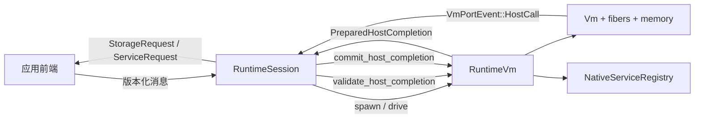
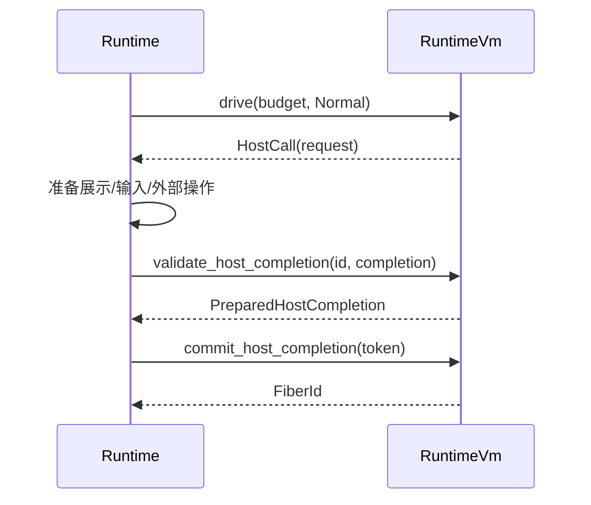

# Runtime–VM 接口文档

本文面向 RustyEra 内部开发与维护人员，说明 `era-runtime` 如何拥有并驱动
`erabasic-vm`。本文以当前源码为准，接口基线为：

- `erabasic-vm` 的 crate 根重导出、`runtime_port.rs`、`runtime_vm.rs`；
- `era-runtime::RuntimeSession` 的 `drive`、Host 分派、状态事务、存档与热重载调用点；
- 当前 VM snapshot 格式版本 `9`，magic 为 `RERAVMS\0`。

相关源码：

- [`erabasic-vm/src/runtime_port.rs`](../crates/erabasic-vm/src/runtime_port.rs)
- [`erabasic-vm/src/runtime_vm.rs`](../crates/erabasic-vm/src/runtime_vm.rs)
- [`erabasic-vm/src/host.rs`](../crates/erabasic-vm/src/host.rs)
- [`era-runtime/src/session/core.rs`](../crates/era-runtime/src/session/core.rs)
- [`era-runtime/src/session/host_dispatch.rs`](../crates/era-runtime/src/session/host_dispatch.rs)
- [`era-runtime/src/session/support.rs`](../crates/era-runtime/src/session/support.rs)

## 1. 接口级别与兼容性

| 层级 | 当前定位 | 兼容性 |
| --- | --- | --- |
| `VmRuntimePort`、`VmRuntimeStatePort`、`VmRestorePort` | Runtime–VM 内部 Rust 接口 | 内部接口；runtime 与 VM 随同一发布实体同步演进，不承诺旧 Rust 调用方兼容 |
| `RuntimeVm` | runtime 使用的 VM 所有者/适配器 | 内部接口；其 `pub` 可见性不等于稳定 SDK |
| `VmHost`、`NativeService`、低层 `Vm` | 通用嵌入接口 | 公开但不属于 runtime 的首选边界；当前仍可变 |
| `VmSnapshot` 容器 | 持久化格式 | 必须校验 magic、格式版本、artifact 与 program version；不兼容时拒绝 |
| `EraState` | runtime 与传统存档适配器之间的数据模型 | 内部可序列化模型，不等于磁盘存档格式 |

脚本可观察语义仍需遵循项目兼容性原则；“内部接口可变”不表示可静默改变游戏规则。

## 2. 职责边界

### 2.1 Runtime 负责

- 创建、替换和释放唯一的 `RuntimeVm`；
- 持有权威生命周期、展示、输入、存储事务、外部服务与协议状态；
- 将 VM 返回的 `VmHostRequest` 分类为同步 Host 操作、输入等待或前端服务请求；
- 在提交 Host 结果前同时完成 runtime 自身的状态准备；
- 决定何时可导出传统存档、VM snapshot、执行 reload 或恢复；
- 将 `VmError`/`VmFault` 投影为 runtime 的拒绝或终止故障。

### 2.2 VM 负责

- 字节码、全局/角色/局部变量、fiber、frame、操作数栈和调度；
- Native service 注册表及其 snapshot 状态；
- Host 请求身份、等待状态和完成值/写入的类型与位置校验；
- runtime 状态事务的全量预验证与原子 memory image 提交；
- VM snapshot、精确恢复、程序代际与热重载迁移；
- 断点、暂停、step 和 stopped-state 检查；详见
  [Runtime 调试接口文档](runtime-debug-interface.zh-CN.md)。

### 2.3 明确不负责

- VM 和 runtime 都不读取文件、不采样系统时钟、不渲染、不采集设备输入；
- `VmRuntimePort` 不回调 runtime；
- frontend 代码不会在单条 VM 指令的分派栈内运行；
- `EraState` 不负责磁盘编码，`VmSnapshot` 也不自行执行 I/O。

## 3. 所有权、线程与执行模型

`RuntimeSession` 是单所有者 actor。其字段 `vm: Option<RuntimeVm>` 独占 VM；启动、恢复、
shutdown 或故障清理时由 runtime 创建、替换或丢弃。`RuntimeVm` 又独占低层 `Vm`、
`NativeServiceRegistry` 与尚未提交的 Native reload 状态。

接口全部是同步 Rust 调用，没有 `async fn`。协作式并发只发生在 VM fiber 内：

- `drive` 按 `RunBudget` 运行有限指令；
- fiber 不占用 OS 线程，也不会抢占；
- Host 边界先产生数据事件，返回调用方后才由 runtime 处理；
- `RuntimeSession` 的编译缓存可使用后台线程，但该线程不拥有或驱动 VM；
- `NativeService: Send`，但 `RuntimeVm` 不提供内部并发访问；调用方仍应串行持有
  `&mut RuntimeVm`。

不得在多个线程上无同步地共享同一个 `RuntimeVm` 或 `RuntimeSession`。需要并行分析或
候选执行时，使用独立实例，或使用 `fork_isolated` 生成隔离候选。



## 4. 公共基础类型

以下所有集合和值均由传入方移动或由被调用方克隆；边界不返回 VM 内部存储引用，唯一例外
是显式只读借用（如 `RuntimeVm::vm()`、`VmRestorePort::restore_waits()`）。

### 4.1 标识符与值

| 类型/字段 | 含义与约束 | 默认/可空 |
| --- | --- | --- |
| `FiberId(pub u64)` | VM 内 fiber 标识；只在所属 VM 时间线及该 fiber 生命周期内有意义，终止回收后可复用 | `0` 可由 `Default` 构造，但不应虚构有效 ID |
| `FrameId(pub u64)` | frame 标识；与 fiber、generation 联合定位局部状态 | 同上 |
| `GenerationId(pub u64)` | 程序代际；reload 后变化 | 同上 |
| `HostRequestId(pub u64)` | VM 生成的 Host 等待标识 | 同上 |
| `VmValue::Integer(i64)` | EraBasic 整数 | 非空 |
| `VmValue::String(String)` | UTF-8 字符串 | 非空；空串合法 |
| `VmValue::IntegerPlace(Box<PlaceDescriptor>)` | 整数位置能力 | 不得自行解引用 |
| `VmValue::StringPlace(Box<PlaceDescriptor>)` | 字符串位置能力 | 不得自行解引用 |

`VmValue::value_type()` 返回相应 `BytecodeType`；`default_for()` 为整数返回 `0`、字符串返回
空串、place 返回默认描述符。后两者只是类型默认值，不代表有效可写目标。

`PlaceDescriptor` 字段：

| 字段 | 含义 |
| --- | --- |
| `variable: SymbolKey` | 稳定 128-bit 变量键 |
| `indices: Vec<u64>` | 每个数组维度一个索引；数量和范围由 VM 再校验 |
| `character: Option<u64>` | 角色变量索引；共享变量为 `None` |
| `fiber: Option<FiberId>` | frame-local place 的所属 fiber |
| `frame: Option<FrameId>` | frame-local place 的所属 frame |

`HostWrite { target, value }` 表示一次 Host/Native 写入。VM 在提交时重新验证变量、frame、
角色、索引和类型；调用方不得缓存 place 并跨 generation 使用。

### 4.2 配置和预算

`VmConfig` 无可空字段：

| 字段 | 默认值 | 单位/语义 |
| --- | ---: | --- |
| `maximum_fibers` | `1024` | fiber 个数 |
| `maximum_call_depth` | `4096` | 每 fiber frame 深度 |
| `maximum_operand_stack` | `1_000_000` | 栈值个数 |
| `maximum_retained_generations` | `8` | reload 后最多保留的程序代际 |
| `maximum_backward_branches_without_progress` | `10_000_000` | 防失控后向分支计数 |
| `maximum_consecutive_budget_exhaustions` | `128` | 连续耗尽 slice 的次数 |
| `maximum_snapshot_bytes` | `1 GiB` | snapshot 解码/编码资源上限，字节 |

`RunBudget`：

| 字段 | 默认值 | 语义 |
| --- | ---: | --- |
| `maximum_instructions` | `100_000` | 本 slice 最多执行的 VM 指令 |
| `maximum_host_calls` | `1024` | 本 slice 最多产生的 Host call |
| `fiber_quantum` | `4096` | 单 fiber 公平调度量子，指令数 |

零预算是合法调用，但通常不会推进执行。`RuntimeSession` 把一次 drive 的剩余指令预算与
协商后的 `maximum_drive_instructions` 取较小值；Host call 上限取协商后的
`maximum_pending_requests`，fiber quantum 当前使用 `RunBudget::default()`。

## 5. 创建、访问和候选状态

### 5.1 构造函数

```rust
pub fn RuntimeVm::new(
    artifact: ValidatedArtifact,
    config: VmConfig,
) -> RuntimeVm

pub fn RuntimeVm::new_with_seed(
    artifact: ValidatedArtifact,
    config: VmConfig,
    seed: u64,
) -> RuntimeVm

pub fn RuntimeVm::new_for_title_with_seed(
    artifact: ValidatedArtifact,
    config: VmConfig,
    seed: u64,
) -> RuntimeVm
```

- 用途：分别创建普通 VM、确定性随机种子 VM、runtime 标题流程的延迟新游戏 VM。
- 前置条件：artifact 已经通过 `erabasic-validator`；所有权被移入 VM。
- 后置效果：创建 memory、generation 及 artifact 对应的 Native registry；没有 root fiber。
- 差异：`new_for_title_with_seed` 只建立标题前状态，CSV 默认值可供 `SYSTEM_TITLE` 使用，
  `ResetData` 和初始角色插入留到内建 new-game 选择确认后。
- 错误：构造函数不返回错误；验证必须在更早阶段完成。

### 5.2 只读和可变逃生口

```rust
pub const fn vm(&self) -> &Vm
pub const fn vm_mut(&mut self) -> &mut Vm
```

这些函数用于 runtime 尚未全部经 port 抽象覆盖的内部操作。`vm_mut()` 可绕过
`VmRuntimePort` 的两阶段约束，只应在解释器 slice 之间使用；新增 runtime 功能优先扩展
窄 port，而不是继续扩大低层耦合。

其他查询：

```rust
pub fn fiber_frame_count(&self, fiber: FiberId) -> Option<usize>
pub fn variable_dimensions(&self, fiber: FiberId, name: &str) -> Option<Vec<u64>>
pub fn has_runnable_fibers(&self) -> bool
pub fn export_random_state(&self) -> Result<Vec<i64>, VmError>
pub fn restore_random_state(&mut self, values: &[i64]) -> Result<(), VmError>
pub fn structured_extensions(
    &self,
    scope: StructuredScope,
) -> Result<Vec<StructuredExtension>, VmError>
```

未知 fiber/变量返回 `None`；随机或结构化 Native 状态缺失、损坏或锁中毒返回
`VmError::InvalidState`。随机状态只应使用 `export_random_state` 的原样结果恢复。

### 5.3 隔离候选

```rust
pub fn fork_isolated(&self) -> Result<RuntimeVm, VmError>
pub fn into_candidate_state(self) -> PreparedCandidateState
pub fn commit_candidate_state(
    &mut self,
    candidate: PreparedCandidateState,
) -> Result<(), VmError>
```

`fork_isolated` 克隆权威 memory 和可 snapshot 的 Native 状态，清除 fiber、scheduler、
pending reload 与 debug 状态。runtime 用它执行候选 `SAVEINFO`。候选执行完成后，
`into_candidate_state` 消耗候选 VM，只保留 memory 与 Native；`commit_candidate_state`
在 artifact identity 完全相同的前提下原子替换权威 memory/Native，不替换调用栈。

错误时权威 VM 不变。不可 snapshot 的 Native service 会使 fork 失败；跨 artifact 候选
返回 `VmError::InvalidState`。

## 6. `VmRuntimePort`

```rust
pub trait VmRuntimePort {
    type PreparedCompletion;
    fn artifact_id(&self) -> Digest;
    fn current_generation(&self) -> GenerationId;
    fn spawn_entry(&mut self, function: SymbolKey, arguments: Vec<VmValue>)
        -> Result<FiberId, VmError>;
    fn fiber_status(&self, fiber: FiberId) -> Option<FiberStatus>;
    fn drive(&mut self, budget: RunBudget, mode: VmDriveMode) -> VmPortDriveReport;
    fn retire_terminal_fibers(&mut self) -> usize;
    fn validate_host_completion(&self, request: HostRequestId, completion: VmHostCompletion)
        -> Result<Self::PreparedCompletion, VmError>;
    fn commit_host_completion(&mut self, completion: Self::PreparedCompletion)
        -> Result<FiberId, VmError>;
    fn cancel_fiber(&mut self, fiber: FiberId) -> Result<(), VmError>;
    fn export_era_state(&self) -> EraState;
    fn restore_era_state(&mut self, state: &EraState) -> Result<EraStateReport, VmError>;
    fn snapshot_eligibility(&self) -> SnapshotEligibility;
    fn snapshot(&self) -> Result<VmSnapshot, VmError>;
    fn encode_snapshot(&self) -> Result<Vec<u8>, VmError>;
    fn prepare_hot_reload(&mut self, target: ValidatedArtifact) -> Result<(), VmError>;
    fn commit_hot_reload(&mut self) -> Result<HotReloadReport, VmError>;
}
```

### 6.1 标识和 root fiber

- `artifact_id`、`current_generation`：只读快照，不改变状态。
- `spawn_entry`：在当前 generation 创建 root fiber，并把它设为 primary fiber。
  未知函数、参数不匹配或 fiber 上限分别产生 `MissingFunction`、`InvalidArguments` 或
  `ResourceLimit`。成功后 fiber 为可调度状态。
- `fiber_status`：未知 ID 返回 `None`；状态为 `Runnable`、`WaitingHost(request)`、
  `WaitingResume`、`Completed(value)`、`Faulted(fault)` 或 `Cancelled`。
- `cancel_fiber`：未知 fiber 返回 `UnknownFiber`；成功后不可再作为正常执行目标。
- `retire_terminal_fibers`：调用方消费完一批终止事件后删除 Completed/Cancelled；当前
  debugger stop 选中的终止 fiber 暂缓删除，Faulted 始终保留用于诊断。删除后旧 ID 可由
  `spawn_entry` 作为最小空闲正整数再次分配，旧 ID 不得再用于查询或控制。

runtime 的系统控制器顺序分派 root，因此不要把 `spawn_entry` 当作应用线程创建 API。

### 6.2 有界驱动

```rust
pub enum VmDriveMode {
    Normal,
    SelectedFiber(FiberId),
}

pub struct VmPortDriveReport {
    pub stop: VmPortStop,
    pub instructions: u64,
    pub events: Vec<VmPortEvent>,
}

pub enum VmPortStop {
    Idle,
    BudgetExhausted,
    DebugStopped,
}
```

`drive` 同步运行一个 slice，不抛出 `VmError`；执行错误以 `FiberFaulted` 事件报告。
`instructions` 是实际执行数量。事件按确定顺序返回：

| `VmPortEvent` | 字段与效果 | runtime 处理 |
| --- | --- | --- |
| `Diagnostic { fiber, code, message, origin, notification }` | 非终止性执行诊断，fiber 已继续到下一条指令；notification 可建议仅记录日志 | 转为带源码位置和通知建议的 runtime `Diagnostic`；当前用于兼容执行但应避免的控制流 |
| `HostCall(VmHostRequest)` | fiber 已停在 `CallHost`，请求仍由 VM 持有 | 分类请求并执行两阶段完成 |
| `FiberYielded(FiberId)` | fiber 主动让出 | 通常继续系统流程 |
| `FiberCompleted(FiberId, Option<VmValue>)` | root/子 fiber 正常结束 | 控制器推进下一事件或等待 |
| `FiberFaulted(FiberId, VmFault)` | 终止性脚本/VM fault | 转为 runtime `Fault` |
| `DebugStopped(VmDebugStop)` | 到达暂停、断点或 step 安全点 | runtime 进入 `DebugPaused` |

`VmDriveMode::Normal` 是 runtime 当前使用的模式。**当前 `RuntimeVm` 对
`SelectedFiber(_)` 直接返回 `DebugStopped`、零指令和空事件；它不是可用的 selected
fiber 执行入口。**

### 6.3 Host 请求字段

`VmHostRequest`：

| 字段 | 含义/所有权 |
| --- | --- |
| `id: HostRequestId` | 当前等待的相关 ID；完成必须原样返回 |
| `fiber: FiberId` | 发起请求的 fiber |
| `import: HostImport` | 编译产物中的完整 Host ABI、能力和事务契约；由事件拥有 |
| `arguments: Vec<VmValue>` | 已求值参数；place 仍为不透明能力 |
| `origin: VmExecutionOrigin` | generation、函数键/名、指令序号、命令和可空源码位置 |

`VmExecutionOrigin.source` 的位置来自 bytecode source map，偏移为 UTF-8 byte offset。

### 6.4 两阶段 Host 完成

`VmHostCompletion`：

| 变体 | 字段 | 语义 |
| --- | --- | --- |
| `Ready(HostReady)` | `value: Option<VmValue>`、`writes: Vec<HostWrite>` | 返回值并提交零或多次 place 写入 |
| `ReturnCurrent(Option<VmValue>)` | 可空返回值 | 从当前 EraBasic frame 返回，不继续 `CallHost` 后指令；root frame 禁止 |
| `Pending { stability, rebind_payload }` | 稳定性、Host 自有不透明 bytes | 保持 fiber 等待；stable wait 可参与精确 snapshot |
| `Error(String)` | 错误文本 | `commit_host_completion` 返回错误；runtime 通常转为 fault |

调用顺序：

1. `drive` 返回 `HostCall(request)`；
2. runtime 准备自身展示、输入、服务或存储变化；
3. 调用 `validate_host_completion(request.id, completion)`；
4. 验证成功得到不透明 `PreparedHostCompletion`；
5. runtime 完成关联的本地准备；
6. 调用 `commit_host_completion(prepared)`；
7. 根据返回的 `FiberId` 继续驱动。

验证阶段检查请求仍新鲜、返回类型、place 所属 fiber、变量存在性、写入类型与索引，
且不修改 VM。提交阶段检查 generation 未变化，再消费 token。普通 Rust 所有权已防止
同一 token 被调用两次；不要用不安全代码复制 token。

`Pending::StableInput` 仅允许在 import 的 `HostSnapshotCapability::StableWait` 下使用；
否则返回 `InvalidState`。`rebind_payload` 由 runtime 定义，VM 只持久化和回传。



常见误用：

- 对过期 `HostRequestId` 提交结果：`StaleHostRequest`；
- 直接信任 Host 返回的 place：VM 会拒绝跨 fiber 或跨代目标；
- 把外部服务 transport wait 标成 `StableInput`：snapshot 能力不匹配；
- validate 后执行 reload，再提交旧 token：generation 检查失败。

## 7. Runtime 状态事务

### 7.1 数据结构

`VmRuntimeRead` 字段为 `variable`、`indices`、`character`；只允许读取 runtime 可见的
非 frame-local 存储。

`VmRuntimeWrite` 在上述三字段外增加 `value`。`VmRuntimeFill` 字段：

- `variable: SymbolKey`：目标变量；
- `value: VmValue`：填充值；
- `all_characters: bool`：角色存储为 `true` 时填充所有角色，否则使用当前 target；
  共享变量忽略此标志。

`VmRuntimeStateTransaction`：

| 变体 | 数据 | 结果 |
| --- | --- | --- |
| `ResetNewGame` | 无 | 初始化新游戏并保留约定的 global 域 |
| `ResetGameData` | 无 | 重置普通游戏数据 |
| `ResetGlobalData` | 无 | 重置 global 数据 |
| `RestoreOrdinary(Box<EraState>)` | 普通存档状态 | 用默认值为基线恢复普通存档 |
| `OverlayGlobal(Box<EraState>)` | global 状态 | 叠加 global 域 |
| `AppendCharacters(Box<EraState>)` | 角色状态 | 追加角色 |
| `SetLastLoad { version, slot, text }` | 版本、slot、说明 | 写入参考流程的最后载入信息 |
| `Mutate { writes, fills, clear_characters, add_characters_from_csv }` | 批量变更 | 一次提交控制器需要的所有变更 |

### 7.2 接口

```rust
pub trait VmRuntimeStatePort {
    fn read_runtime_state(&self, reads: &[VmRuntimeRead])
        -> Result<Vec<VmValue>, VmError>;
    fn prepare_runtime_state(&self, transaction: VmRuntimeStateTransaction)
        -> Result<PreparedRuntimeState, VmError>;
    fn commit_runtime_state(&mut self, prepared: PreparedRuntimeState)
        -> Result<(), VmError>;
}
```

- `read_runtime_state` 保持请求顺序；任一目标缺失、frame-local 或越界时整体报错。
- `prepare_runtime_state` 在克隆的 memory image 上校验全部操作，不修改 VM。
- `PreparedRuntimeState` 字段私有，包含 generation、候选 memory、是否清空执行状态及
  可空结构化 Native 状态；只能交回同一接口提交。
- `commit_runtime_state` 要求 generation 未变。成功后一次替换 memory；需要时清空
  fiber/call stack。
- `RuntimeVm` 还提供
  `prepare_runtime_state_with_extensions(transaction, scope, values)`，把 memory 与
  VAREXT 结构化数据作为同一准备操作，并返回成功导入的 `(kind, key)` 集合。

`StructuredScope` 为 `Ordinary | Global`；`StructuredExtension` 为：

- `Map { key, entries: Vec<(String, String)> }`；
- `Xml { key, document }`；
- `DataTable { key, schema, data }`。

未知或未声明的结构化记录会被忽略，runtime 存档适配器可无损保留 opaque extension。

## 8. 传统状态、snapshot、恢复与 reload

### 8.1 `EraState`

`EraVariableState`：

| 字段 | 含义 |
| --- | --- |
| `name: String` | EraBasic 变量名 |
| `value_type: BytecodeType` | 值类型 |
| `dimensions: Vec<u64>` | 数组维度 |
| `persistence: BytecodePersistence` | 保存域 |
| `storage: BytecodeStorage` | VM 存储种类 |
| `values: Vec<VmValue>` | 确定性展开值 |

`EraState` 字段为 `unique_code: i64`、`version: i64`、
`variables: BTreeMap<SymbolKey, EraVariableState>` 和每角色一个 map 的
`characters`。`EraSaveScope` 为 `Ordinary`、`Global`、`Characters`。

`EraStateReport` 的 `restored_variables`、`skipped_variables`、
`restored_characters` 均为计数，默认 `0`。

`export_era_state` 只导出普通存档域；磁盘格式由 runtime-save adapter 编码。
`restore_era_state` 校验游戏 code/version，成功后丢弃调用栈和 waits；不负责选择后续
入口函数。

### 8.2 VM snapshot

```rust
pub fn snapshot_eligibility(&self) -> SnapshotEligibility
pub fn snapshot(&self) -> Result<VmSnapshot, VmError>
pub fn encode_snapshot(&self) -> Result<Vec<u8>, VmError>

pub fn VmSnapshot::decode(
    bytes: &[u8],
    maximum_bytes: usize,
) -> Result<VmSnapshot, VmError>

pub fn inspect_snapshot(
    bytes: &[u8],
    maximum_bytes: usize,
) -> Result<SnapshotInspection, VmError>
```

`SnapshotEligibility` 为 `Eligible` 或 `Ineligible(Vec<SnapshotBlocker>)`。blocker：

- `PendingHotReload`；
- `PrimaryFiberNotSnapshotStable`；
- `RunnableFiber(fiber)`；
- `TransientHostWait(fiber)`；
- `AwaitResume(fiber)`；
- `OldGenerationFrame(fiber, generation)`；
- `LegacyGenerationState`；
- `NativeService(message)`。

`VmSnapshot` 内部字段私有；公开查询只有 `program_version()`、`artifact_id()`、
`encode()`。容器包含版本、精确 artifact、memory、非回收 fiber、primary fiber、ID
分配状态和按 key 排序的 Native state。稳定 Host wait 要求 primary 指向等待 fiber；完全
静止且 fiber 集合为空也可做 snapshot。恢复旧 v9 终止历史后会回收 Completed/Cancelled
并把 fiber 分配提示规范化为最小空闲 ID。`decode` 校验大小、header、格式版本、压缩长度、
checksum 和序列化数据。

`inspect_snapshot` 与 `decode` 使用同一套验证逻辑，将容器元数据和全部序列化执行状态
投影为可序列化的检查结果。不透明 Native state 与稳定 Host wait 的重新绑定 payload
只包含字节长度和 BLAKE3，不输出原始内容。该低层接口供 runtime 的完整快照分析复用；
它不持有原 bytecode artifact，不能解析符号名称或执行最终恢复兼容性检查。

### 8.3 两阶段恢复

```rust
pub trait VmRestorePort: Sized {
    type PreparedRestore;
    fn prepare_restore(
        artifact: ValidatedArtifact,
        config: VmConfig,
        snapshot: VmSnapshot,
    ) -> Result<Self::PreparedRestore, VmError>;
    fn restore_waits(plan: &Self::PreparedRestore) -> &[VmWaitRebind];
    fn commit_restore(plan: Self::PreparedRestore) -> Result<Self, VmError>;
}
```

`VmWaitRebind` 字段：

- `request: HostRequestId`；
- `fiber: FiberId`；
- `import: RuntimeImport`；
- `payload: Vec<u8>`，即原 Host 的 opaque rebind payload。

runtime 在 prepare 后把 `restore_waits()` 与其 snapshot 中的稳定输入逐一对应并重新签发
epoch-scoped token，最后消费 plan。artifact、format、program version、资源限制或 wait
集合不一致均必须拒绝，不能部分恢复。

### 8.4 热重载

`prepare_hot_reload(target)` 先迁移 Native 状态并准备 VM artifact；失败不改变当前程序。
`commit_hot_reload()` 只能在 slice 之间调用，要求存在 plan、base generation 未变化且
保留代际未超限。

`HotReloadReport` 字段：

- `old_generation`、`new_generation`；
- `retained_generations`；
- `added_variables`、`removed_variables`、`resized_variables`。

提交后新 frame 使用新 generation，旧 frame 可暂留；超过
`maximum_retained_generations` 返回 `ResourceLimit`。类型、storage class 或 owner
变化不可迁移。reload 会重新绑定 debugger breakpoint。

## 9. 低层 Host 与 Native 接口

### 9.1 `VmHost`

```rust
pub trait VmHost {
    fn call(&mut self, request: HostCallRequest) -> HostCallResult;
    fn rebind_snapshot(
        &mut self,
        requests: &[HostRebindRequest],
    ) -> Result<(), String>;
}
```

这是低层 `Vm::run_slice` 的回调接口，不是 `RuntimeSession` 的实现方式。runtime 的
`RuntimeVm` 使用私有 capture host，使 callback 只收集请求，随后投影成
`VmPortEvent::HostCall`。

`HostCallRequest` 字段为 `id`、`fiber`、`import: RuntimeImport`、`arguments`、`origin`。
`HostCallResult` 为 `Ready`、`Pending`、`Error` 或仅适配器可用的 `Deferred`。
`rebind_snapshot` 必须整批原子；默认实现仅接受空集合。

### 9.2 `NativeService`

```rust
pub trait NativeService: Send {
    fn implicit_place_names(&self) -> &'static [&'static str];
    fn call(&mut self, request: NativeCallRequest) -> Result<NativeReady, String>;
    fn snapshot(&self) -> Result<Option<Vec<u8>>, String>;
    fn restore(&mut self, state: &[u8]) -> Result<(), String>;
}
```

`NativeCallRequest` 包含 `import`、值参数 `arguments`、显式 `places` 和以名字索引的
`implicit_places`。每个 `NativePlaceView` 包含参数序号、opaque target 和调用前解析的
值快照。Native 不能直接解引用 VM memory，只能返回 `NativeReady { value, writes }`。

`snapshot() == Ok(None)` 表示该 service 阻止 VM snapshot；默认 service 为无状态，空
bytes 可恢复。`NativeServiceRegistry::for_artifact[_with_seed]` 注册编译器已知服务，
`register(key, service)` 返回该 key 之前是否为空。重复注册会替换原 service并返回
`false`。

### 9.3 Runtime 使用的 VM 调试 port

Runtime 负责公共 Debug 协议授权、runtime 游戏字段和时间冻结；VM port 只负责一致的
执行/变量视图。主要签名：

```rust
pub trait VmDebugInspect {
    fn stop_token(&self) -> Option<VmStopToken>;
    fn fibers(&self, stop: VmStopToken, cursor: Option<usize>, limit: usize)
        -> Result<VmDebugPage<VmDebugFiber>, VmError>;
    fn call_stack(&self, stop: VmStopToken, fiber: FiberId)
        -> Result<Vec<VmDebugFrame>, VmError>;
    fn operand_stack(
        &self, stop: VmStopToken, fiber: FiberId, frame: FrameId,
        cursor: Option<usize>, limit: usize,
    ) -> Result<VmDebugPage<VmDebugOperand>, VmError>;
    fn variables(&self, stop: VmStopToken, cursor: Option<usize>, limit: usize)
        -> Result<VmDebugPage<VmDebugVariable>, VmError>;
    fn read_variable(&self, stop: VmStopToken, target: &VmDebugVariableRef)
        -> Result<VmDebugVariable, VmError>;
}

pub trait VmDebugControl {
    fn request_pause(&mut self) -> Result<VmDebugStop, VmError>;
    fn continue_execution(&mut self, stop: VmStopToken) -> Result<(), VmError>;
    fn step(&mut self, stop: VmStopToken, fiber: FiberId, kind: VmStepKind)
        -> Result<(), VmError>;
    fn write_variables(
        &mut self, stop: VmStopToken, writes: &[VmDebugVariableWrite],
    ) -> Result<Vec<VmDebugVariable>, VmError>;
    fn update_breakpoints(
        &mut self, breakpoints: &[VmBreakpoint], remove: &[u64],
    ) -> Result<Vec<VmResolvedBreakpoint>, VmError>;
}
```

`VmStopToken {pause_epoch,generation}` 必须与 VM 当前 stop 精确一致。分页结果
`VmDebugPage<T> {values,next_cursor?}` 的 limit 为 1–1024。frame、operand、变量和断点的
公开字段分别是：

- `VmDebugStop {token,reason,selected_fiber?,source?}`；reason 为 PauseRequested、
  Breakpoint(id)、StepCompleted、HostWait、FiberCompleted、Fault 或 Reload；
- `VmDebugFiber {id,status,primary,frame_count}`；
  `VmDebugFrame {id,generation,function,function_name,instruction,source?}`；
  `VmDebugOperand {offset,value}`；
- `VmDebugVariableRef {target,generation}`；
  `VmDebugVariable {target,name,mutable,value,revision}`；
  `VmDebugVariableWrite {target,value,expected_revision}`；
- `VmBreakpoint {id,enabled,hit_count,location}`；location 是
  `Source{relative_path,content_hash,byte_offset}` 或 `Function(SymbolKey)`；
- `VmResolvedBreakpoint {id,generation,binding,source?,message?,hit_count}`；
  binding 为 Verified、Moved、Unbound。

除 `request_pause` 和 `update_breakpoints` 外，检查/控制都需要 stop。continue/step
成功后旧 stop 失效；变量批写为 1–1024 项，先验证全部目标与 revision，任一失败则回滚。
断点总数上限 4096。runtime 将这些内部对象投影为公共 Debug 4.0 类型，完整调用时序、
scope 与 EraBasic 控制台语义见 [Runtime 调试接口文档](runtime-debug-interface.zh-CN.md)。

## 10. 错误模型与处理建议

`VmError`：

| 变体 | 语义 | runtime 建议 |
| --- | --- | --- |
| `MissingFunction(SymbolKey)` | 入口不存在 | 项目/控制器错误，通常 fault |
| `InvalidArguments(String)` | 类型、数量、索引或目标错误 | Host/调试请求可拒绝；脚本执行通常 fault |
| `ResourceLimit(&'static str)` | creator 配置上限 | 映射稳定资源错误，不盲目重试 |
| `InvalidState(String)` | 时序或内部不变量错误 | stale 请求可恢复；其余视为内部错误 |
| `UnknownFiber(FiberId)` | fiber 不存在 | 调试/控制请求拒绝 |
| `StaleHostRequest(HostRequestId)` | request 已完成、取消或跨代 | 丢弃晚到 completion |
| `HotReload(String)` | reload 准备/提交失败 | 保持旧 artifact，报告 reload 失败 |
| `Snapshot(String)` | snapshot 不稳定、损坏或不兼容 | 不修改当前 VM；要求精确项目或重新开始 |
| `Save(String)` | 传统状态不兼容 | 拒绝存档，保留现状 |

`VmFault` 是脚本执行事件，字段含稳定 `VmFaultCode`、消息、fiber、generation、函数键/名、
指令、命令和可空源码位置。不要仅解析本地化 `message`；优先使用 code 与结构化 origin。

## 11. 完整调用顺序

正常 runtime 时间线：

1. 分析、编译并验证项目，获得 `ValidatedArtifact`；
2. `RuntimeVm::new_for_title_with_seed`；
3. `spawn_entry(SYSTEM_TITLE, [])`；
4. 循环 `drive(RunBudget, Normal)`；
5. 顺序处理所有事件，随后调用 `retire_terminal_fibers`；
6. 对每个 Host call 执行 `validate_host_completion` 后再
   `commit_host_completion`；
7. 等待外部结果时停止驱动可运行 fiber；结果到达后再提交；
8. stable input 或静止状态才做 snapshot；
9. reload 使用 prepare/commit；
10. shutdown 时 runtime 丢弃 `RuntimeVm`，Rust `Drop` 释放 memory、fibers 与 Native。

## 12. 常见误用

- 把 `RuntimeVm::vm_mut()` 当作公开扩展点，绕过 runtime 权威状态；
- 在 `drive` 尚未返回时调用 frontend 或 runtime 代码；
- 用 `EraState` bytes 冒充传统 `.sav` 文件，或用裸 `VmSnapshot` 冒充完整 runtime
  snapshot；
- 跨 epoch/generation 缓存 `PlaceDescriptor`、`HostRequestId` 或 prepared token；
- 在 runnable fiber、transient wait、pending reload 下强制 snapshot；
- 认为 `FiberCompleted` 表示整个 runtime 已结束；系统控制器可能继续分派事件；
- 认为 `VmDriveMode::SelectedFiber` 当前已实现。

## 13. 待确认

1. `VmRuntimePort` 的注释要求未来实现拒绝“已消费 token”，当前
   `PreparedHostCompletion` 仅依靠 Rust move 语义与 generation/request freshness，没有
   独立 nonce/消费登记。若未来 token 跨 FFI 或可克隆，需要确认是否增加显式一次性检查。
   位置：[`runtime_port.rs`](../crates/erabasic-vm/src/runtime_port.rs)、
   [`runtime_vm.rs`](../crates/erabasic-vm/src/runtime_vm.rs)。
2. `VmDriveMode::SelectedFiber` 在 trait 中描述为 prospective debugger 模式，但
   `RuntimeVm` 当前不执行它。需要确认该变体是保留接口还是后续实现目标。
   位置：[`runtime_vm.rs`](../crates/erabasic-vm/src/runtime_vm.rs)。
3. `RuntimeVm::vm_mut()` 暴露整个低层 VM，与“窄 runtime port”目标并存。需要确认哪些
   调用点应迁移到 port，以及该函数是否最终降为 crate-private。

## 附录 A：接口索引

| 分类 | 接口 |
| --- | --- |
| 创建/访问 | `RuntimeVm::{new,new_with_seed,new_for_title_with_seed,vm,vm_mut}` |
| 查询/候选 | `read_host_place`、`fiber_frame_count`、`variable_dimensions`、`has_runnable_fibers`、`fork_isolated`、`into_candidate_state`、`commit_candidate_state` |
| 随机/结构化 | `export_random_state`、`restore_random_state`、`structured_extensions`、`prepare_runtime_state_with_extensions` |
| 主 port | `VmRuntimePort` 全部 14 个方法 |
| 状态事务 | `VmRuntimeStatePort::{read_runtime_state,prepare_runtime_state,commit_runtime_state}` |
| 恢复 | `VmRestorePort::{prepare_restore,restore_waits,commit_restore}` |
| snapshot | `VmSnapshot::{program_version,artifact_id,encode,decode}`、`inspect_snapshot`、`SnapshotInspection`、`SNAPSHOT_MAGIC`、`SNAPSHOT_FORMAT_VERSION` |
| 低层 Host | `VmHost::{call,rebind_snapshot}` |
| Native | `NativeService`、`NativeServiceRegistry::{for_artifact,for_artifact_with_seed,register}`、`evaluate_pure_native` |
| 调试 | `VmDebugInspect`、`VmDebugControl` 及其 stop/page/variable/breakpoint 类型；第 9.3 节 |

## 附录 B：最小可运行端到端示例

下面示例构造一份最小已验证 artifact，通过 `RuntimeVm` 创建 root fiber，运行到完成并
检查事件。把它放入 workspace 内任一依赖
`erabasic-bytecode`、`erabasic-csv`、`erabasic-validator`、`erabasic-vm` 的 binary
crate 即可运行。

```rust
use erabasic_bytecode::{
    ArtifactManifest, BytecodeArtifact, BytecodeCallCompatibility, BytecodeFunction,
    BytecodeFunctionKind, Digest, SourceMap, SymbolKey, opcode,
};
use erabasic_csv::{CsvLoadOptions, ProjectFiles, load_project};
use erabasic_validator::{ValidationContext, validate_bytecode};
use erabasic_vm::{
    RunBudget, RuntimeVm, VmConfig, VmDriveMode, VmPortEvent, VmRuntimePort,
};

fn main() -> Result<(), Box<dyn std::error::Error>> {
    let project_data = load_project(&ProjectFiles::default(), &CsvLoadOptions::default())
        .data
        .ok_or("default project data did not load")?;
    let entry = SymbolKey::derive("example.function", b"SYSTEM_TITLE");
    let function = BytecodeFunction {
        key: entry,
        name: "SYSTEM_TITLE".into(),
        kind: BytecodeFunctionKind::Normal,
        parameters: Vec::new(),
        result: None,
        labels: Vec::new(),
        imports: Vec::new(),
        max_stack: 1,
        code: vec![opcode::return_value(false)],
    };
    let mut artifact = BytecodeArtifact {
        manifest: ArtifactManifest::new(Digest::default()),
        call_compatibility: BytecodeCallCompatibility::default(),
        project_data,
        globals: Vec::new(),
        native_imports: Vec::new(),
        host_imports: Vec::new(),
        functions: vec![function],
        event_groups: Vec::new(),
        source_map: SourceMap::default(),
    };
    artifact.refresh_ids()?;
    let report = validate_bytecode(
        artifact.clone().into_unvalidated(),
        &ValidationContext::for_artifact(&artifact),
    );
    if !report.diagnostics.is_empty() {
        return Err(format!("{:#?}", report.diagnostics).into());
    }
    let validated = report.value.ok_or("validation produced no artifact")?;

    let mut vm = RuntimeVm::new_with_seed(validated, VmConfig::default(), 1);
    let fiber = vm.spawn_entry(entry, Vec::new())?;
    let report = vm.drive(RunBudget::default(), VmDriveMode::Normal);
    assert!(report.events.iter().any(
        |event| matches!(event, VmPortEvent::FiberCompleted(id, None) if *id == fiber)
    ));
    println!("完成：{} 条指令，stop={:?}", report.instructions, report.stop);
    Ok(())
}
```
